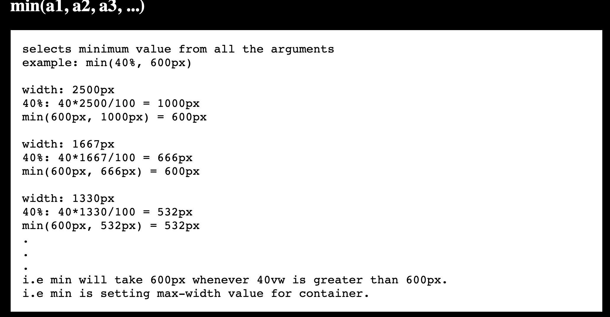
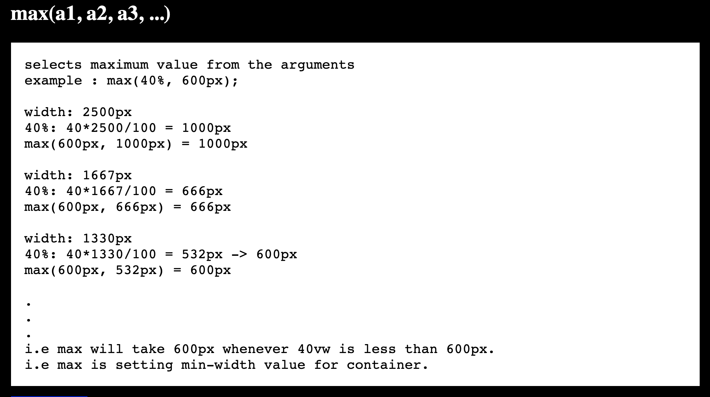
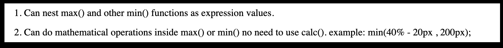
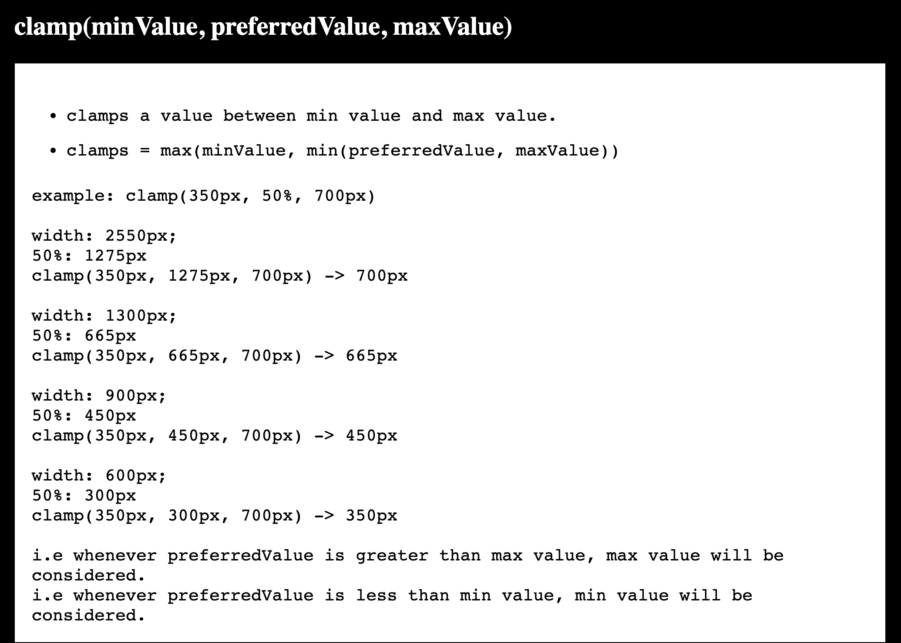

# Css Min Max Clamp Functions
Introductory Guide to CSS Min(), Max() and Clamp() Functions

**Along with basic Min, Max, Clamp examples the repository have examples demonstrating few usecases such as**
1) Handing dynamic padding and margin
2) Min, Max, Clamp with Flex
3) Fluid Typography

## Min

## Max

## Clamp

